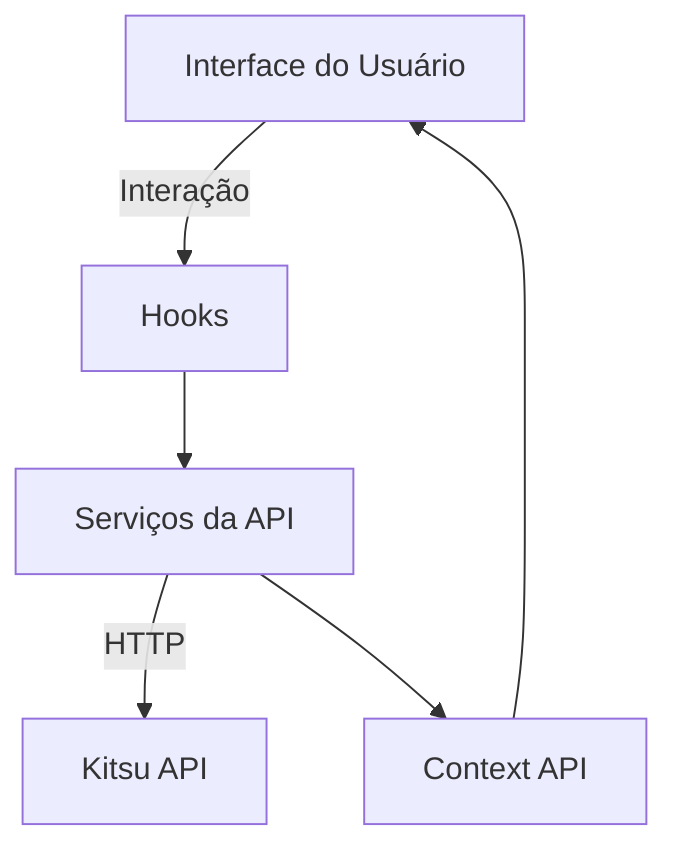

# Turivius Anime Test

**Projeto desenvolvido como solução para o desafio frontend da Turivius, criando uma aplicação web de animes utilizando a API do Kitsu.**  

Destaques do projeto:

✅ Código bem organizado e modularizado  
✅ Boas práticas de desenvolvimento (responsividade, performance, acessibilidade)  
✅ Interface criativa e intuitiva  
✅ Experiência dinâmica e fluída para o usuário  

---

## 📌 Visão Geral

**Contexto:**  
Desafio técnico para demonstrar habilidades em desenvolvimento frontend moderno.  

**Objetivos:**  
- Criar uma aplicação completa de listagem de animes  
- Implementar funcionalidades essenciais (busca, filtros, paginação)  
- Garantir excelente UX/UI  

**Valor entregue:**  
Solução robusta que demonstra domínio das tecnologias e boas práticas de desenvolvimento.  

---

## 📌 Funcionalidades Principais

- **Página Inicial**  
  - Carrossel interativo com animes em destaque  
  - Botão "Ver Todos" para navegação completa  

- **Listagem de Animes**  
  - Paginação inteligente  
  - Layout adaptável para diferentes dispositivos  

- **Sistema de Busca**  
  - Barra de pesquisa na Navbar  
  - Filtragem em tempo real  

- **Navegação por Categorias**  
  - Sidebar com gêneros de animes  
  - Visualização filtrada por categoria  

- **Detalhes do Anime**  
  - Página dedicada com informações completas  

---

## 🛠 Stack Tecnológico

- **Frontend:** React + TypeScript  
- **Estilização:** Styled Components  
- **Build:** Vite  
- **HTTP Client:** Axios  
- **Gerenciamento de Estado:** Context API  

---

## 🚀 Como executar o projeto

### Pré-requisitos

- Node.js (v18 ou superior recomendado)  
- npm (ou yarn/pnpm, se preferir)  
- Git (para clonar o repositório)  

### Passo a passo

1. **Clone o repositório**
   ```bash
   git clone https://github.com/danzprogdanz/turivius-anime-test.git
   cd turivius-anime-test

2. **Instale as dependências**
   ```bash
   npm install

3. **Ambiente de desenvolvimento**
   ```bash
   npm run dev
   ```
  - O servidor de desenvolvimento iniciará em: http://localhost:5173

---

## 🏗 Arquitetura 
**Estrutura Modular por Camadas**  
A arquitetura do projeto segue uma organização em camadas, promovendo separação de responsabilidades, alta coesão e baixo acoplamento. Isso facilita a manutenção, escalabilidade e testes.

📦 **src/**  
├── **api/**                # Comunicação com API externa (Kitsu)  
│   ├── **services/**       # Serviços específicos para recursos (animes, categorias)  
│   ├── **types/**          # Tipagens dos dados recebidos  
│   └── **api.ts**          # Configuração base do Axios  
│  
├── **assets/**             # Recursos estáticos (imagens, ícones)  
│  
├── **components/**         # Componentes reutilizáveis  
│   ├── **common/**         # Elementos comuns (Header, ícones, paginação)  
│   ├── **layout/**         # Layouts e estilos estruturais  
│   └── **ui/**             # Elementos específicos da interface (Navbar, Sidebar, etc)  
│  
├── **context/**            # Context API para estado global (busca, categorias)  
│  
├── **design-system/**       # Design tokens e utilitários visuais  
│   ├── **constants/**       # Constantes como breakpoints, z-index, layouts  
│   ├── **core/**            # Cores, espaçamentos, tipografia  
│   ├── **providers/**       # Provedores de temas/contextos globais  
│   ├── **themes/**          # Temas personalizados  
│   └── **utils/**           # Funções auxiliares para o design  
│  
├── **hooks/**              # Custom hooks  
│   ├── **api/**            # Hooks relacionados à API  
│   └── **gerais/**         # Outros hooks úteis (scroll infinito, media query)  
│  
├── **pages/**              # Páginas da aplicação  
│   ├── **Home/**                  # Página inicial (carrossel, destaque)  
│   ├── **AnimeDetails/**          # Detalhes do anime  
│   ├── **AnimesByCategory/**      # Listagem por categoria  
│   ├── **AnimesList/**            # Lista geral com paginação  
│   └── **Categories/**            # Gêneros disponíveis  
│  
├── **router/**            # Definição de rotas  
│  
├── **utils/**             # Utilitários gerais  
│  
├── **App.tsx**            # Componente raiz  
├── **main.tsx**           # Entrada da aplicação (ReactDOM.render)  
└── **vite-env.d.ts**       # Tipagens específicas do Vite  

**Padrões e Boas Práticas**  
- **Atomic Design (adaptado):** Separação de componentes por responsabilidade e reutilização.  
- **Separation of Concerns:** Divisão clara entre UI, lógica de negócio, dados e comunicação externa.  
- **Hooks personalizados:** Encapsulam regras de negócio e lógica reutilizável.  
- **Context API:** Compartilhamento eficiente de estado entre componentes.  
- **Responsividade:** Uso de helpers (mediaQueriesHelper.ts) e design tokens.  
- **Modularização inteligente:** Facilita a expansão do projeto com novas features ou rotas.  

**Fluxo de Dados**  

---

✉ **Contato:** danieldvm7@gmail.com | [LinkedIn](https://www.linkedin.com/in/daniel-viana-a6bb59174/)

---
